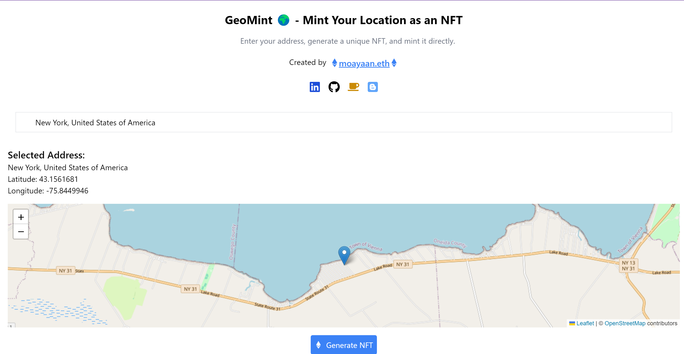
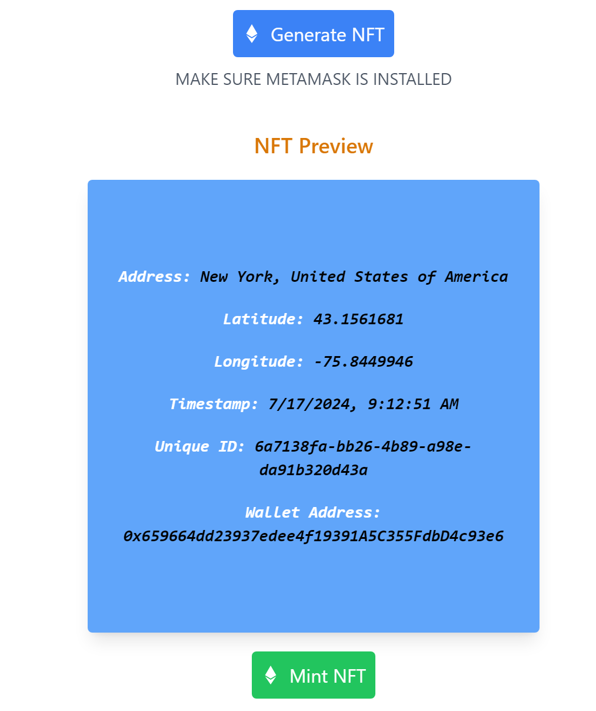
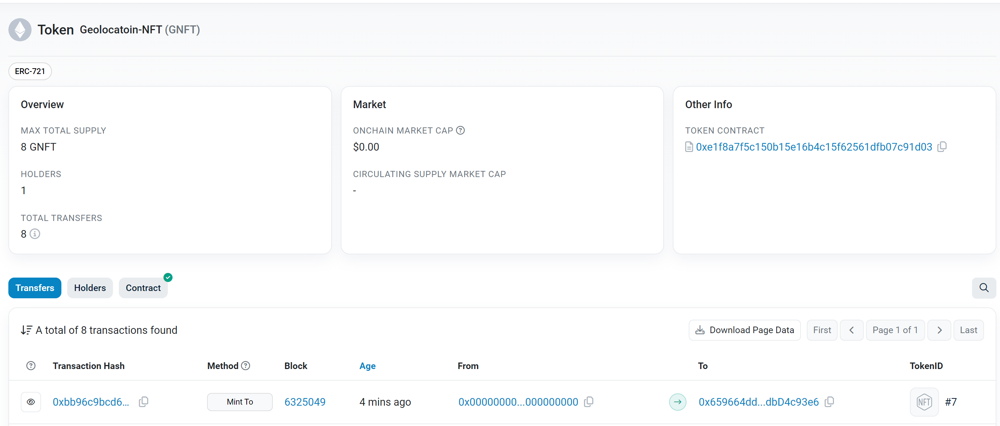

<!-- @format -->

# GeoMint 🌍

## Description

GeoMint allows you to mint your geographic location into unique NFTs, turning your special spots into digital collectibles.

## Deployed Link

[GeoMint Live Demo](https://geomint.onrender.com/)

## Video Demo

[Watch the Demo on YouTube](https://youtu.be/q0QosOD_d_k)

## Preview

 
<video width="320" height="240" controls>
  <source src="./public/demo.mp4" type="video/mp4">
  Your browser does not support the video tag.
</video>

## Tech Stack

- ⚛️ **React**: Frontend library for building user interfaces
- 🟦 **TypeScript**: Strongly typed programming language that builds on JavaScript
- 📄 **HTML/CSS**: Markup and styling
- 🌐 **Ethers.js**: Ethereum blockchain interaction library
- 🎨 **Tailwind CSS**: Utility-first CSS framework for rapid UI development
- 💾 **Vite**: Frontend build tool

## Features

- 🌍 **Geolocation Integration**: Convert your location data into NFTs seamlessly.
- 🖼️ **NFT Preview**: Preview your NFT before minting.
- 🔗 **Blockchain Integration**: Connect to the Ethereum network directly from the interface.
- 🎉 **Real-Time Updates**: Watch NFT transactions unfold in real-time.
- 🛠️ **User-Friendly Interface**: Easy-to-use interface, ensuring a smooth user experience.
